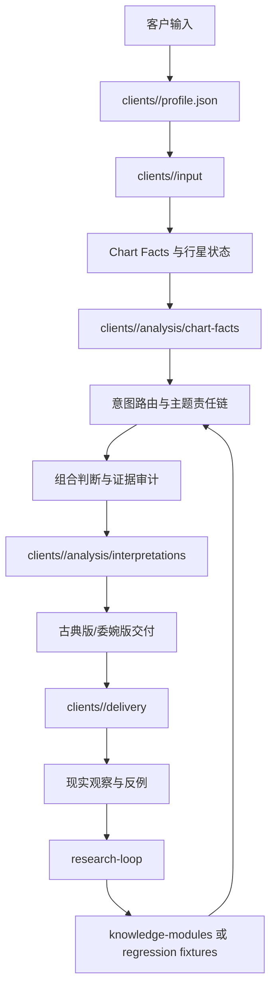

# 项目整体信息架构

这套项目不是单一的“读盘文案目录”，而是一条从客户资料到可发布咨询、再回流到知识系统的证据链。每类信息只有一个 canonical owner，其他位置只能做兼容副本、索引或引用。

## 总体结构

## 六个信息层

| 层 | 唯一职责 | 正式位置 | 不应放什么 |
|---|---|---|---|
| 客户层 | 保存客户提供的事实、资料完整度和家庭关系 | `clients/` | 不把客户资料散落到研究笔记 |
| 计算层 | 生成可复核的出生盘、宫头、行星状态和时限结果 | `astrology_engine/` + 客户 `analysis/chart-facts/` | 不在计算代码里保存个人档案 |
| 解释层 | 路由主题、飞宫、互容、组合判断和文案模式 | `config/`、`references/interpretation-modules/` | 不把未经验证的网络观点当核心规则 |
| 知识层 | 管理来源、知识卡、等级、条件和反证 | `references/knowledge-modules/` | 不直接接收无来源摘录 |
| 研究层 | 管理网络/书籍/PDF的候选资料和研究循环 | `references/research-loop/` | 不存放新的客户原始资料 |
| 质量层 | 管理夹具、失败案例、回归脚本和发布门禁 | `references/fixtures/`、`scripts/` | 不把测试输出冒充客户结论 |

## 文件归属规则

1. 收到新客户资料，先建立 `case_id` 和 `profile.json`，再保存原始输入。
2. 正式计算输出必须写到客户目录的 `analysis/chart-facts/`；命令行预览可以输出到 stdout。使用 `run_natal_pipeline.py --case-id` 时由系统自动写入标准目录，并保留引擎、宫制、黄道、坐标、时区来源和来源版本。
3. 咨询文本必须记录 `route_id`、证据链、反证和发布状态；古典版与委婉版共享同一证据，不各自重新推理。
4. 网络资料先进入 `research-loop`，只有完成来源定位、条件化改写、反例和回归，才可进入知识模块。
5. 现实事件只能进入客户 `observations/`，经隐私门禁后才可作为学习候选。
6. `references/loop-runs/` 是历史归档，不再作为新客户资料入口。

### 知识插件的可调用编码

运行时插件的唯一清单是 `references/knowledge-modules/plugins.json`，稳定短符号的唯一索引是 `config/knowledge_symbols.yaml`。任何可调用插件都必须同时声明唯一 `@` 符号、别名、触发条件、优先级和回退路径，并由 `config/module_dispatch.yaml` 路由；只有研究文档而没有这些字段的内容，不得被模型直接调用。涉及本命结构的扩展（例如冥王相位、火星与个人星体相位）必须登记在 `natal_core_extensions`，随 Chart Facts 进入本命通道，而不是作为孤立专题文件。符号只负责定位，不提高证据等级：仍须先完成 Chart Facts、责任链和相应审计，再按插件自己的证据上限输出。

本命解读先经过 `references/signification-ontology.yaml` 与 `scripts/expand_signification_map.py`：内部穷举可用星体/辅助点、宫位、相位、尊贵与交付条件的关键词和关系边，随后由组合层按责任链、证据等级、反证和时限选择主机制。因而“完整覆盖”属于内部审计要求，不等于把所有词条无差别倾倒给客户。

## 生命周期状态

`intake → facts → interpretation → release_gate → delivery → observation → learning`

每一步都必须有输入、输出和来源。计算完成不等于可发布；只有组合判断、反证、来源和发布闸门全部完成，才能从 `hold` 进入 `publishable`。缺少出生时间、地点、度数或宫制时，状态应为 `hold/incomplete`，不能用模板句补齐。

## 机器校验

- `config/information_architecture.yaml`：信息层、文件契约、生命周期和禁止跨层写入。
- `scripts/check_client_registry.py`：客户目录和索引校验。
- `scripts/new_client_case.py`：按时间、地点和资料完整度创建标准案例目录。
- `scripts/check_project_architecture.py`：整体架构、路由节点、客户目录和历史归档边界校验。
- `scripts/check_architecture_coupling.py`：插件符号单一权威、计算引擎边界和运行时编排器规模校验。
- `config/quality_gate.yaml` + `scripts/run_quality_gate.py`：按固定顺序执行全部必需回归检查，输出统一质量报告。

每次增加目录、数据类型或新的知识插件，都要先更新架构清单，再添加文件和测试。
